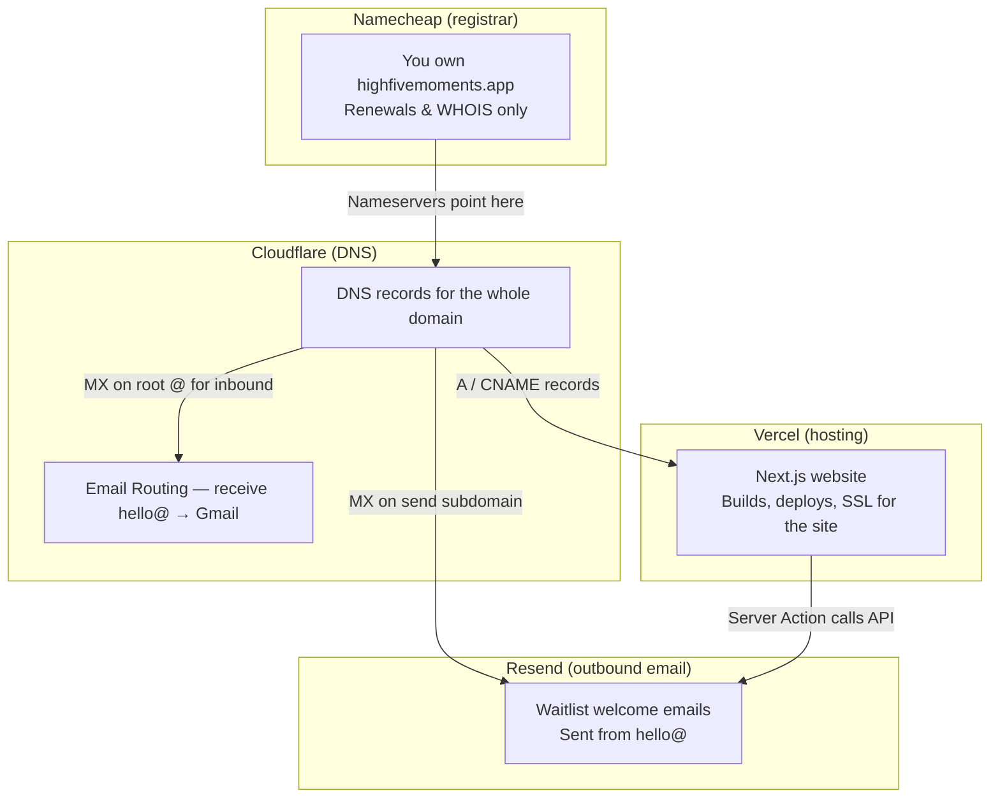

# Infrastructure & DNS — highfivemoments.app

This doc explains **who does what** for the domain, website, and email. Four services are involved, but each has a single job.

## The big picture



## Who does what (one sentence each)

| Service | Role | You log in to… |
|---------|------|----------------|
| **Namecheap** | Domain **registration** (you pay for the name) | [namecheap.com](https://www.namecheap.com) |
| **Cloudflare** | **DNS** for the domain + **receive** email at `@highfivemoments.app` | [dash.cloudflare.com](https://dash.cloudflare.com) |
| **Vercel** | **Host** the Next.js website | [vercel.com](https://vercel.com) |
| **Resend** | **Send** transactional email (waitlist welcome) | [resend.com](https://resend.com) |

**Namecheap does not host the site or handle day-to-day DNS anymore.** After setup, nameservers point to Cloudflare. Namecheap is only where you renew the domain.

**Cloudflare is not hosting.** It’s the phone book: it tells the internet where the website lives (Vercel) and where mail should go (Resend + Email Routing).

**Vercel is not email.** It only serves the website and runs server actions (including calling Resend’s API).

---

## DNS records cheat sheet

All records below are managed in **Cloudflare → DNS → Records**. Use **DNS only** (grey cloud) unless you deliberately want Cloudflare proxy later.

### Website → Vercel (when the site goes live)

Add these after connecting the domain in **Vercel → Project → Settings → Domains**. Confirm exact values in Vercel — they may match:

| Type | Name | Content | Notes |
|------|------|---------|--------|
| A | `@` | `76.76.21.21` | Apex domain → Vercel |
| CNAME | `www` | `cname.vercel-dns.com` | www → Vercel |

`vercel.json` redirects `www` → apex. Canonical URL: `https://highfivemoments.app`.

### Outbound email → Resend (sending)

These live on the **`send`** subdomain and **`resend._domainkey`** — separate from website and inbound mail.

| Type | Name | Content | Priority |
|------|------|---------|----------|
| TXT | `resend._domainkey` | *(DKIM value from Resend dashboard)* | — |
| MX | `send` | `feedback-smtp.us-east-1.amazonses.com` | 10 |
| TXT | `send` | `v=spf1 include:amazonses.com ~all` | — |

Verify status in [Resend → Domains](https://resend.com/domains). Domain must show **verified** before production sends work.

### Inbound email → Cloudflare Email Routing (receiving)

Enable in **Cloudflare → Compute → Email Service → Email Routing → Onboard Domain**. Cloudflare adds root-domain records automatically, for example:

| Type | Name | Purpose |
|------|------|---------|
| MX | `@` | Route incoming mail to Cloudflare |
| TXT | `@` | SPF for routing |
| TXT | `cf2024-1._domainkey` | DKIM for routed mail |

Then create routing rules, e.g. `hello@highfivemoments.app` → your Gmail.

**Resend (send subdomain) and Cloudflare Routing (root @) do not conflict** — different hostnames, different jobs.

### Two ways email leaves `hello@highfivemoments.app`

These are separate systems. Do not mix them up.

| Path | Who sends | Used for |
|------|-----------|----------|
| **Resend** | The website (server action → Resend API) | Automated waitlist welcome emails |
| **Gmail “Send mail as”** | You, manually in Gmail | Replies to people who emailed `hello@` |

**Resend** has nothing to do with your Gmail inbox. The site never sends mail through Gmail.

**Gmail “Send mail as”** is an optional Gmail setting (*Settings → See all settings → Accounts → Send mail as*) so that when someone emails `hello@` (forwarded to your Gmail by Cloudflare) and you hit Reply, the recipient sees `hello@highfivemoments.app` — not your personal `@gmail.com` address.

Cloudflare Email Routing only handles **receiving** and forwarding inbound mail. It does not make Gmail send outbound mail as `hello@` automatically. If you can already compose/reply as `hello@` in Gmail, this step is done.

---

## API keys & local env files

| File / location | Key | Permission | Used by |
|-----------------|-----|------------|---------|
| `.env.local` / Vercel env | `RESEND_API_KEY` | **Send only** | Next.js app (waitlist emails) |
| `.env.resend-mcp` | `RESEND_API_KEY` | **Full access** | Cursor Resend MCP only — **never** deploy to Vercel |
| Vercel env | Supabase keys, `RESEND_*`, Turnstile keys, `WAITLIST_PRODUCTION_ENABLED`, `NEXT_PUBLIC_SITE_URL` | Per service | Production only for writes/email |

Copy template: `cp .env.example .env.local`

MCP config: `.cursor/mcp.json` runs `scripts/run-resend-mcp.sh`, which loads `.env.resend-mcp`.

---

## Setup checklist

### Done

- [x] Domain registered at Namecheap
- [x] Cloudflare connected (**Connect a domain**, not transfer)
- [x] Nameservers at Namecheap → Cloudflare (`cameron.ns.cloudflare.com`, `heather.ns.cloudflare.com`)
- [x] Resend domain created for `highfivemoments.app`
- [x] Resend DNS records in Cloudflare (DKIM, `send` MX, `send` SPF TXT)
- [x] **Resend domain verified** — [resend.com/domains](https://resend.com/domains) shows green
- [x] Cursor Resend MCP (full-access key in `.env.resend-mcp`)
- [x] **Cloudflare Email Routing** — domain onboarded, destination verified, `hello@` → Gmail rule
- [x] Inbound mail test — mail to `hello@highfivemoments.app` arrives in Gmail
- [x] **Gmail “Send mail as”** — reply from `hello@` in Gmail (optional personal setup; not Resend)
- [x] **Vercel** — repo imported, env vars, domain, A/CNAME in Cloudflare
- [x] **Preview Deployment Protection** — enabled in Vercel project settings
- [x] **Production env separation** — `WAITLIST_PRODUCTION_ENABLED=true` on Production only; omitted on Preview
- [x] **Cloudflare Turnstile** — widget keys for waitlist bot protection
- [x] **Supabase migration** — `supabase/migrations/20250626000000_waitlist_security.sql` applied
- [x] End-to-end test — waitlist signup sends welcome email on production
- [x] **Google Search Console** — Domain property `highfivemoments.app` verified via Cloudflare DNS integration; sitemap submitted

### Still to do

- [ ] **`MAILING_ADDRESS` (deferred)** — add when you have a business or P.O. Box address. CAN-SPAM expects a valid physical postal address in marketing-style emails; until then the welcome email footer falls back to `High Five Moments`. Acceptable for pre-launch; set before scaling email volume.

  ```bash
  npx vercel env add MAILING_ADDRESS production --value "High Five Moments, [street or PO Box], [city, postcode, country]" --yes --sensitive
  ```

  Then redeploy Production.

---

## Google Search Console

Search Console is how Google reports indexing status, crawl issues, and (once you have traffic) search queries and impressions. It is separate from **Vercel Analytics**, which tracks on-site visits and conversion events.

**Dashboard:** [search.google.com/search-console](https://search.google.com/search-console)

### Setup (verified via Cloudflare)

Use a **Domain** property for `highfivemoments.app` — not a URL-prefix property for `www`. Domain verification covers apex, `www`, and any future subdomains. That matches this project: canonical URL is `https://highfivemoments.app` and `vercel.json` redirects `www` → apex.

1. **Add property** → choose **Domain** → enter `highfivemoments.app`.
2. **Verify ownership** → choose the **DNS** method.
3. **Cloudflare integration (recommended):** When GSC detects that DNS is on Cloudflare, it offers to connect your Cloudflare account and add the `google-site-verification` TXT record automatically. Sign in, approve, and verification completes in seconds — no manual record copy/paste in the Cloudflare dashboard.
4. **Manual DNS fallback:** If the integration is unavailable, copy the TXT value from GSC and add it in **Cloudflare → DNS → Records** (Type `TXT`, Name `@`, DNS only / grey cloud).
5. **Submit sitemap:** **Indexing → Sitemaps** → enter `https://highfivemoments.app/sitemap.xml` → Submit. The site generates this from `src/app/sitemap.ts`; `robots.txt` already references it.
6. **Request indexing (optional):** **URL inspection** (top search bar) → enter `https://highfivemoments.app/` → **Request indexing**. Repeat for `/privacy` if desired.

No code changes are required for DNS verification. The site already exposes `/sitemap.xml`, `/robots.txt`, and JSON-LD in `layout.tsx`.

### What to monitor (current UI labels)

Google has renamed some sidebar items. The report you want for “is Google indexing my pages?” is **Indexing → Pages** — the page header reads **Page indexing**. That is the same report; there is no separate “Page indexing” link in the sidebar.

| Sidebar (2025+) | What it shows | When it becomes useful |
|-----------------|---------------|------------------------|
| **Overview** | High-level property health | Immediately after verification |
| **URL inspection** | Status of a single URL; request indexing | Anytime |
| **Performance** | Clicks, impressions, queries, average position | After Google starts showing the site in search (often weeks) |
| **Indexing → Pages** | Indexed vs not indexed; reasons pages are excluded | 1–3 days after verification (until then: *“Processing data…”*) |
| **Indexing → Sitemaps** | Sitemap fetch status, discovered URLs | Within hours of submitting the sitemap |
| **Experience → Core Web Vitals** | LCP, INP, CLS from field data | After enough real-user Chrome data |
| **Links** | External links pointing to the site | As backlinks appear |

**Expected on a new site:** **Indexing → Pages** and **Overview** often show *“Processing data, please check again in a day or so”* for the first 24–48 hours. That does not mean setup failed — Google has not finished the first crawl pass yet.

**Not indexed by design:** `/thank-you` is intentionally omitted from the sitemap (post-signup page, not a landing URL).

---

## Common questions

### Why three vendors for one domain?

- **Namecheap** — you bought the name there; no need to transfer.
- **Cloudflare** — free DNS + free inbound email routing (`hello@` → Gmail); enough for now without a dedicated mailbox provider.
- **Vercel** — best fit for this Next.js repo.
- **Resend** — simple API + React Email for welcome messages.

### Should Cloudflare be “proxied” (orange cloud)?

For Vercel, use **DNS only** (grey cloud) on website records. Vercel already provides CDN and SSL. Orange cloud is optional later for WAF/extra protection.

### Custom MX in Namecheap Mail Settings?

Ignore it once nameservers point to Cloudflare. **Inbound mail uses Cloudflare Email Routing** (root `@` MX records Cloudflare adds when you onboard). **Do not** put Resend’s outbound MX there — Resend only needs DNS on the **`send`** subdomain in Cloudflare.

We do **not** use a third-party mailbox host at the moment (e.g. Zoho Mail or Google Workspace); Cloudflare forwarding to Gmail is enough for early stage. If the app and business grow, a proper mailbox provider would be the likely next step.

### Where do I change DNS now?

**Cloudflare only.** Changes in Namecheap Advanced DNS are ignored once nameservers point to Cloudflare.

---

## Quick links

| Task | URL |
|------|-----|
| Cloudflare DNS | [dash.cloudflare.com](https://dash.cloudflare.com) → highfivemoments.app → DNS |
| Email Routing | Cloudflare → Compute → Email Service → Email Routing |
| Resend domains | [resend.com/domains](https://resend.com/domains) |
| Vercel project | [vercel.com/dashboard](https://vercel.com/dashboard) |
| Namecheap renewals | [namecheap.com](https://www.namecheap.com) → Domain List |
| Google Search Console | [search.google.com/search-console](https://search.google.com/search-console) |
