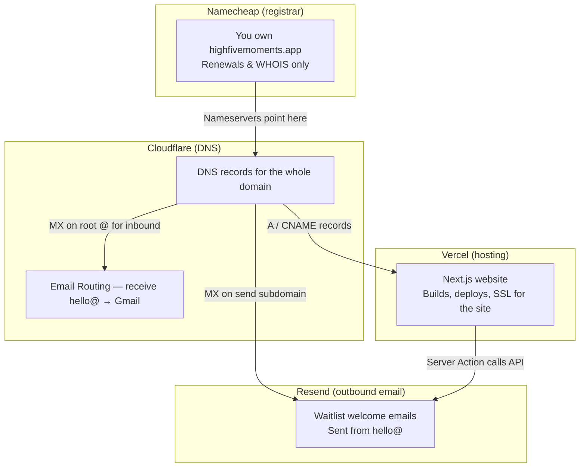

# Infrastructure & DNS — highfivemoments.app

This doc explains **who does what** for the domain, website, and email. Four services are involved, but each has a single job.

## The big picture

## Who does what (one sentence each)

| Service | Role | You log in to… |
|---------|------|----------------|
| **Namecheap** | Domain **registration** (you pay for the name) | [namecheap.com](https://www.namecheap.com) |
| **Cloudflare** | **DNS** for the domain + **receive** email at `@highfivemoments.app` | [dash.cloudflare.com](https://dash.cloudflare.com) |
| **Vercel** | **Host** the Next.js website | [vercel.com](https://vercel.com) |
| **Resend** | **Send** transactional email (waitlist welcome) | [resend.com](https://resend.com) |

**Namecheap does not host the site or handle day-to-day DNS anymore.** After setup, nameservers point to Cloudflare. Namecheap is only where you renew the domain.

**Cloudflare is not hosting.** It’s the phone book: it tells the internet where the website lives (Vercel) and where mail should go (Resend + Email Routing).

**Vercel is not email.** It only serves the website and runs server actions (including calling Resend’s API).

---

## DNS records cheat sheet

All records below are managed in **Cloudflare → DNS → Records**. Use **DNS only** (grey cloud) unless you deliberately want Cloudflare proxy later.

### Website → Vercel (when the site goes live)

Add these after connecting the domain in **Vercel → Project → Settings → Domains**. Confirm exact values in Vercel — they may match:

| Type | Name | Content | Notes |
|------|------|---------|--------|
| A | `@` | `76.76.21.21` | Apex domain → Vercel |
| CNAME | `www` | `cname.vercel-dns.com` | www → Vercel |

`vercel.json` redirects `www` → apex. Canonical URL: `https://highfivemoments.app`.

### Outbound email → Resend (sending)

These live on the **`send`** subdomain and **`resend._domainkey`** — separate from website and inbound mail.

| Type | Name | Content | Priority |
|------|------|---------|----------|
| TXT | `resend._domainkey` | *(DKIM value from Resend dashboard)* | — |
| MX | `send` | `feedback-smtp.us-east-1.amazonses.com` | 10 |
| TXT | `send` | `v=spf1 include:amazonses.com ~all` | — |

Verify status in [Resend → Domains](https://resend.com/domains). Domain must show **verified** before production sends work.

### Inbound email → Cloudflare Email Routing (receiving)

Enable in **Cloudflare → Compute → Email Service → Email Routing → Onboard Domain**. Cloudflare adds root-domain records automatically, for example:

| Type | Name | Purpose |
|------|------|---------|
| MX | `@` | Route incoming mail to Cloudflare |
| TXT | `@` | SPF for routing |
| TXT | `cf2024-1._domainkey` | DKIM for routed mail |

Then create routing rules, e.g. `hello@highfivemoments.app` → your Gmail.

**Resend (send subdomain) and Cloudflare Routing (root @) do not conflict** — different hostnames, different jobs.

---

## API keys & local env files

| File / location | Key | Permission | Used by |
|-----------------|-----|------------|---------|
| `.env.local` / Vercel env | `RESEND_API_KEY` | **Send only** | Next.js app (waitlist emails) |
| `.env.resend-mcp` | `RESEND_API_KEY` | **Full access** | Cursor Resend MCP only — **never** deploy to Vercel |
| Vercel env | Supabase keys, `RESEND_*`, `NEXT_PUBLIC_SITE_URL` | Per service | Production / preview |

Copy template: `cp .env.example .env.local`

MCP config: `.cursor/mcp.json` runs `scripts/run-resend-mcp.sh`, which loads `.env.resend-mcp`.

---

## Setup checklist

### Done (as of initial setup)

- [x] Domain registered at Namecheap
- [x] Cloudflare connected (**Connect a domain**, not transfer)
- [x] Nameservers at Namecheap → Cloudflare (`cameron.ns.cloudflare.com`, `heather.ns.cloudflare.com`)
- [x] Resend domain created for `highfivemoments.app`
- [x] Resend DNS records in Cloudflare (DKIM, `send` MX, `send` SPF TXT)
- [x] Cursor Resend MCP (full-access key in `.env.resend-mcp`)

### Still to do

- [ ] **Resend domain verified** — [resend.com/domains](https://resend.com/domains) shows green
- [ ] **Cloudflare Email Routing** — onboard domain, verify destination inbox, add `hello@` → Gmail rule
- [ ] **Vercel** — import repo, env vars, add domain, add A/CNAME in Cloudflare
- [ ] **Gmail “Send mail as”** (optional) — reply from `hello@` from Gmail after routing works
- [ ] End-to-end test — waitlist signup sends welcome email; mail to `hello@` arrives in Gmail

---

## Common questions

### Why three vendors for one domain?

- **Namecheap** — you bought the name there; no need to transfer.
- **Cloudflare** — free DNS + free inbound email routing; easier than fighting Namecheap’s mail UI.
- **Vercel** — best fit for this Next.js repo.
- **Resend** — simple API + React Email for welcome messages.

### Should Cloudflare be “proxied” (orange cloud)?

For Vercel, use **DNS only** (grey cloud) on website records. Vercel already provides CDN and SSL. Orange cloud is optional later for WAF/extra protection.

### Custom MX in Namecheap Mail Settings?

That section is for **root-domain incoming mail** (Zoho, Gmail Workspace, etc.). **Do not** put Resend’s MX there. Resend uses Host Records / Cloudflare DNS on the **`send`** subdomain.

### Where do I change DNS now?

**Cloudflare only.** Changes in Namecheap Advanced DNS are ignored once nameservers point to Cloudflare.

---

## Quick links

| Task | URL |
|------|-----|
| Cloudflare DNS | [dash.cloudflare.com](https://dash.cloudflare.com) → highfivemoments.app → DNS |
| Email Routing | Cloudflare → Compute → Email Service → Email Routing |
| Resend domains | [resend.com/domains](https://resend.com/domains) |
| Vercel project | [vercel.com/dashboard](https://vercel.com/dashboard) |
| Namecheap renewals | [namecheap.com](https://www.namecheap.com) → Domain List |
